

# 💅 Beauty Salon — платформа онлайн-записи

### Telegram Mini App для клиентов + CRM для салона + умные уведомления

*Полноценная система записи: клиент бронирует в пару касаний прямо в Telegram, салон управляет расписанием, ценами и аналитикой в веб-панели.*

**Stack:** Telegram Mini App · React · Next.js · Supabase · Vercel

📱 **Попробовать вживую:** [@beautyapp_salon_bot](https://t.me/beautyapp_salon_bot)

Разработано <b>G&D Digital Lab</b> · gddlab.ru

---

## 📌 О проекте

**Beauty Salon** — это готовая платформа онлайн-записи для бьюти-индустрии (салоны красоты, барбершопы, студии маникюра, косметология). Клиент записывается на услуги прямо внутри Telegram, без установки приложений и регистрации, а салон получает удобную CRM с расписанием, ценами, акциями и аналитикой.

Система состоит из трёх связанных частей:

| Часть | Для кого | Что делает |
|-------|----------|------------|
| **Telegram Mini App** | Клиенты салона | Витрина услуг, запись, корзина, избранное, отзывы, свои записи |
| **Админ-CRM** | Сотрудники салона | Управление расписанием, услугами, ценами, акциями, заказами, аналитика |
| **Сервис уведомлений** | Автоматика | Подтверждения, напоминания, запросы отзывов — без участия человека |

---

## 💎 Ценность для бизнеса

- **Запись 24/7 без звонков и администратора.** Клиент бронирует сам, в любое время — салон не теряет заявки в нерабочие часы.
- **Меньше неявок.** Автонапоминания за день и за 3 часа + кнопка подтверждения визита снижают «забыл прийти».
- **Канал в Telegram, где клиент уже есть.** Не нужно «затаскивать» в отдельное приложение — запись открывается в один тап из чата.
- **Допродажи через комплексы и подарки.** Гибкий движок акций: скидки и подарочные услуги при заказе комплекса.
- **Прозрачная аналитика.** Выручка, загрузка мастеров, популярные услуги, эффективность акций — на одном экране.
- **Репутация на автопилоте.** После визита клиент получает приглашение оставить отзыв; отзывы проходят модерацию и формируют рейтинг мастеров.

---

## ✨ Что умеет

### Для клиентов (Telegram Mini App)

- **Витрина услуг** — категории с вложенностью, услуги с фото, ценой и длительностью.
- **Карточки мастеров** — фото, рейтинг, опыт, портфолио работ и отзывы.
- **Запись в пару касаний** — выбор услуги → мастера → даты → свободного времени. Слоты считаются автоматически с учётом расписания, перерывов и уже занятых броней.
- **Честная цена сразу** — стоимость со скидкой видна до подтверждения записи.
- **Корзина на несколько услуг** — запись на комплекс процедур одним заказом, у каждой услуги свой мастер и время.
- **Подарки и комплексы** — при заказе нужного набора услуг подарочная позиция добавляется автоматически.
- **Мои записи** — предстоящие и прошедшие, с отменой (с разумным порогом по времени).
- **Отзывы** — две оценки (мастер и услуга) + комментарий, с модерацией.
- **Избранное** — сохранение любимых мастеров и услуг.
- **Профиль** — избранное и история отзывов с фильтрами.
- **Нижнее меню** — Главная · Записи · Корзина · Профиль.

### Для салона (Админ-CRM)

- **Заказы** — лента заявок с рабочим процессом статусов (новая → подтверждена → завершена и т.д.) в реальном времени.
- **Специалисты** — расписание по дням, перечень услуг и индивидуальные цены, портфолио, модерация отзывов.
- **Услуги** — древовидный каталог категорий и услуг.
- **Акции** — конструктор скидок (процент/сумма на услугу, категорию или весь салон) и подарков-комплексов с триггерами.
- **Клиенты** — база клиентов и аналитика по ним.
- **Аналитика** — выбор периода, диаграммы выручки и загрузки, детализация по мастерам и услугам, оценка эффективности акций.

### Умные уведомления (автоматически)

- ✅ **Подтверждение записи** — сразу после брони.
- 📅 **Напоминание за день** — с кнопкой «Приду» (клиент подтверждает визит в один тап).
- ⏰ **Напоминание за 3 часа** — с кнопкой «Отменить запись» (с подтверждением, чтобы не отменить случайно).
- ⭐ **Запрос отзыва** — после визита, с переходом на экран оценки.

---

## 📱 Как это выглядит (Telegram Mini App)

<table>
  <tr>
    <td align="center">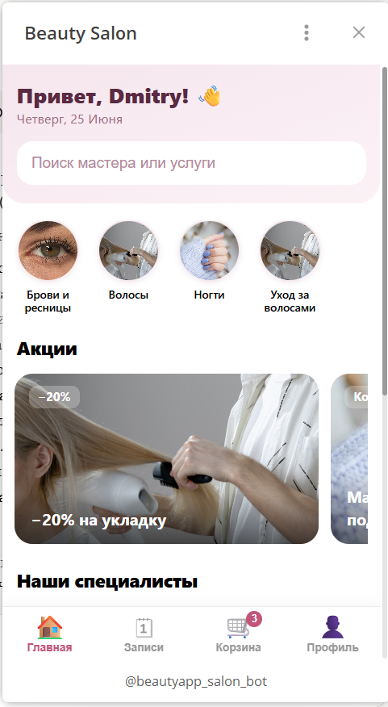 <b>Главная — категории и акции</b></td>
    <td align="center">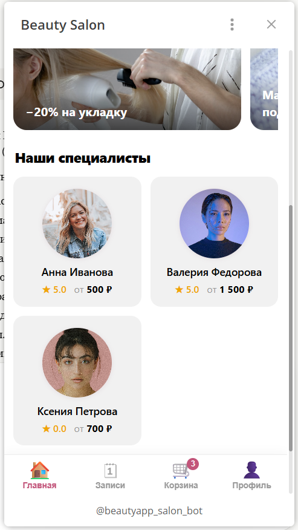 <b>Наши специалисты</b></td>
    <td align="center">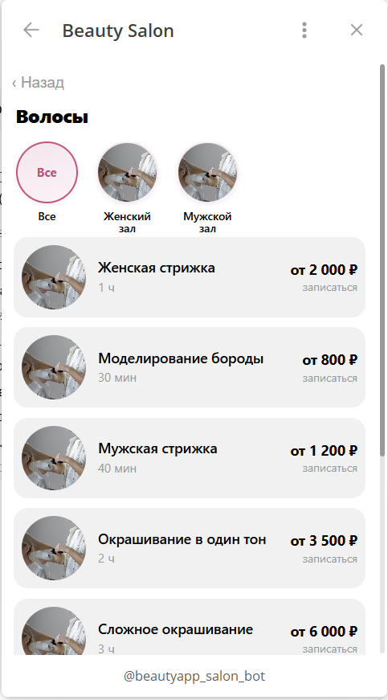 <b>Категория и услуги</b></td>
  </tr>
  <tr>
    <td align="center">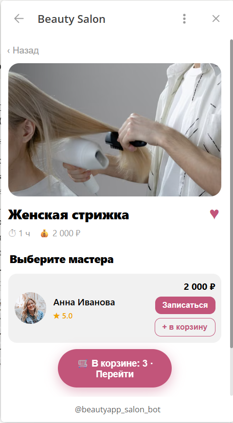 <b>Услуга — выбор мастера</b></td>
    <td align="center">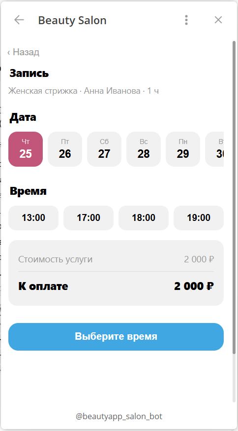 <b>Запись — дата, время, цена</b></td>
    <td align="center">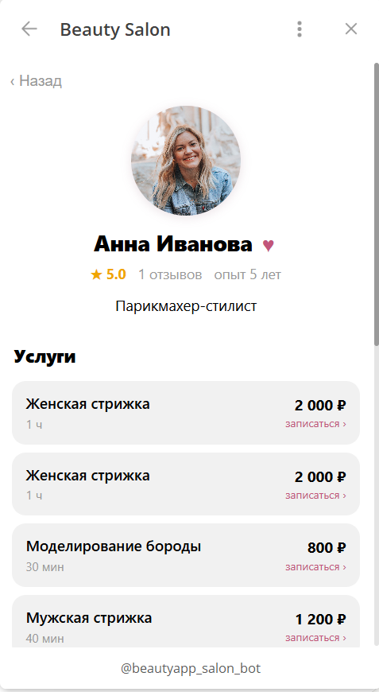 <b>Карточка мастера</b></td>
  </tr>
  <tr>
    <td align="center">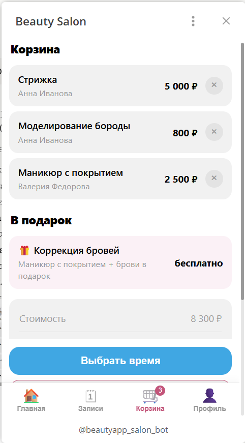 <b>Корзина и подарок</b></td>
    <td align="center">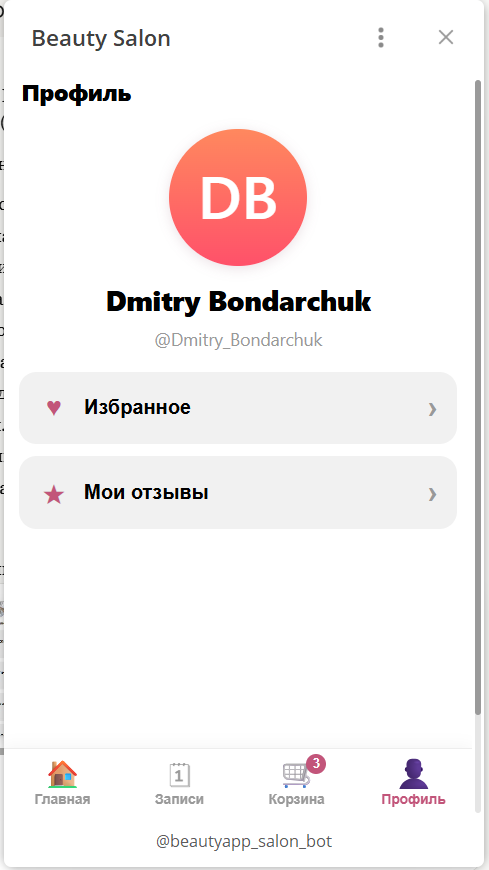 <b>Профиль</b></td>
    <td align="center">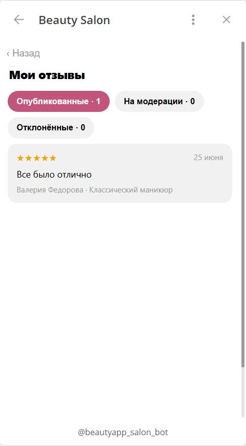 <b>Мои отзывы</b></td>
  </tr>
  <tr>
    <td align="center" colspan="3">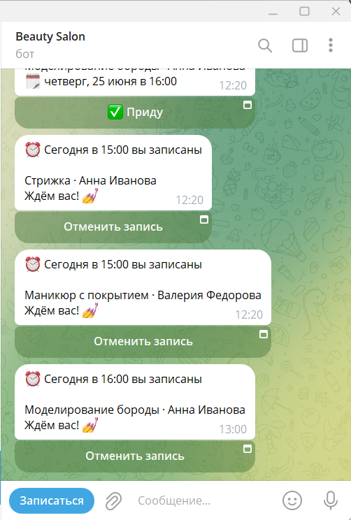 <b>Умные уведомления в Telegram</b></td>
  </tr>
</table>

---

## 🖥️ Админ-панель салона (CRM)

<table>
  <tr>
    <td align="center">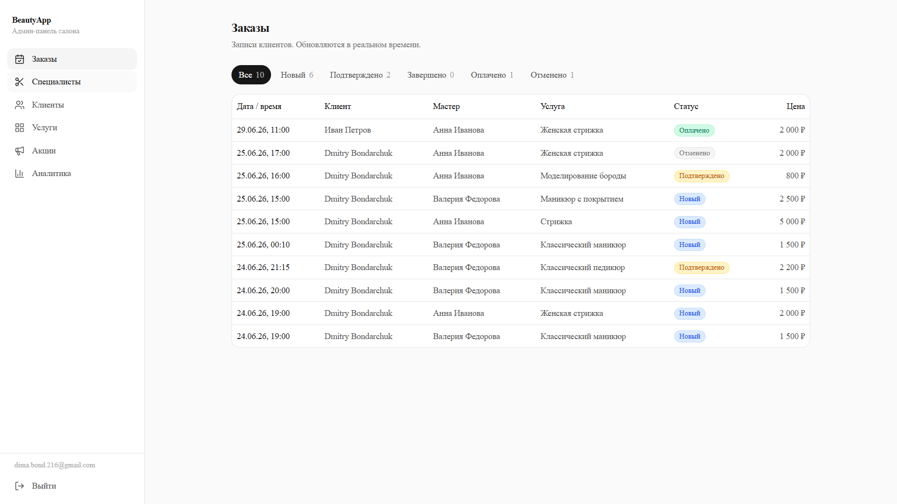 <b>Заказы — лента заявок в реальном времени</b></td>
    <td align="center">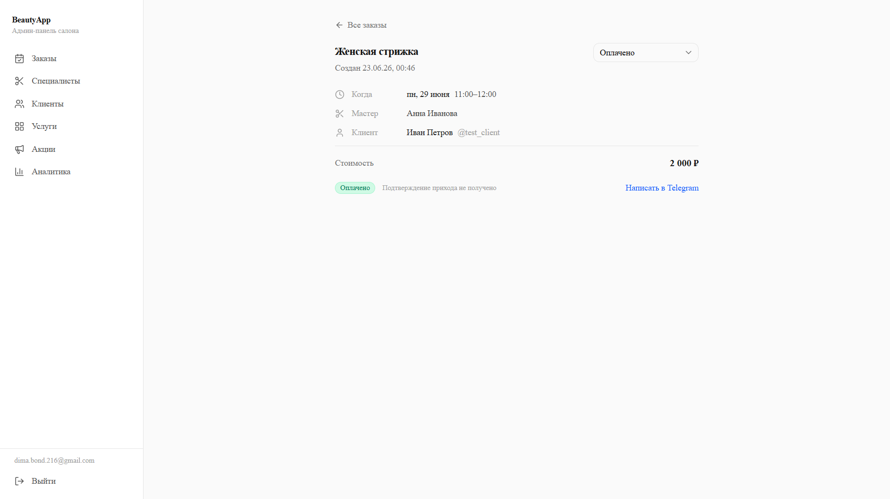 <b>Карточка заказа со сменой статуса</b></td>
  </tr>
  <tr>
    <td align="center">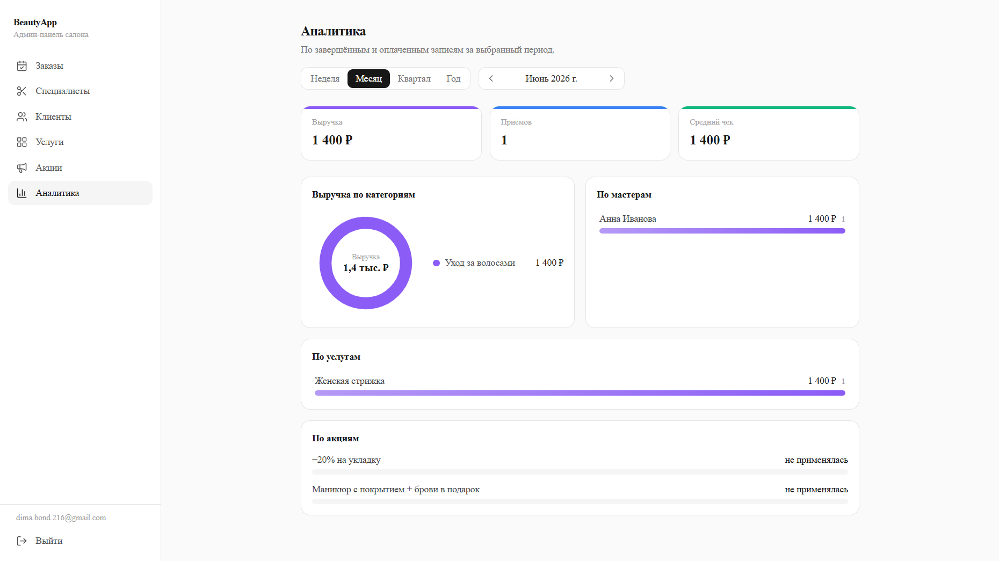 <b>Аналитика — выручка, мастера, услуги, акции</b></td>
    <td align="center">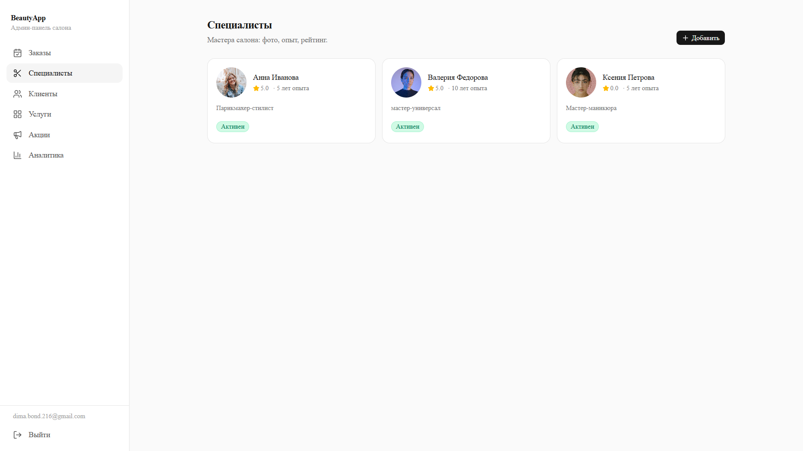 <b>Специалисты салона</b></td>
  </tr>
  <tr>
    <td align="center">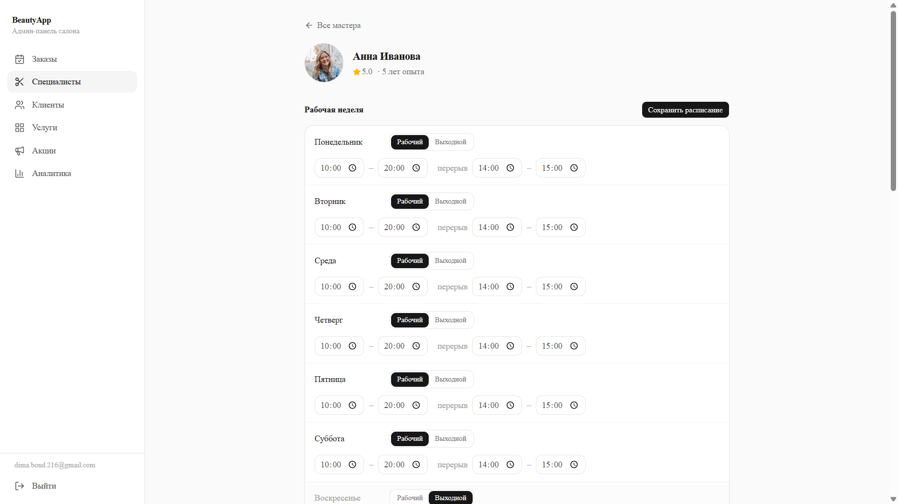 <b>Расписание мастера и перерывы</b></td>
    <td align="center">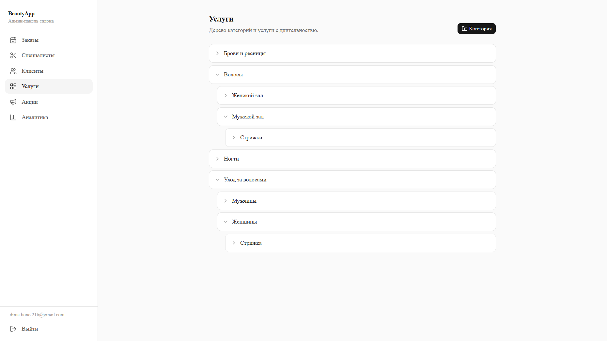 <b>Дерево категорий и услуг</b></td>
  </tr>
  <tr>
    <td align="center">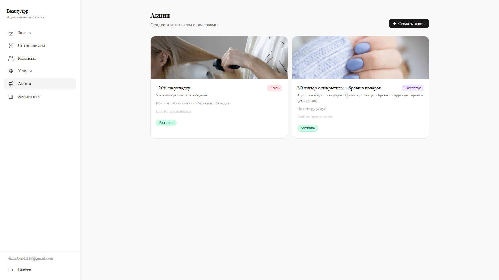 <b>Акции: скидки и комплексы с подарками</b></td>
    <td align="center">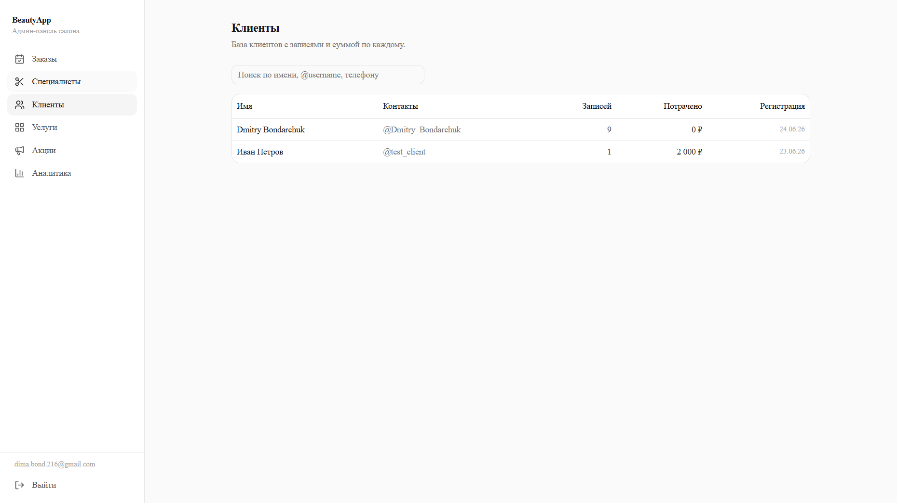 <b>База клиентов с историей и суммами</b></td>
  </tr>
</table>

---

## 🔧 Как это устроено

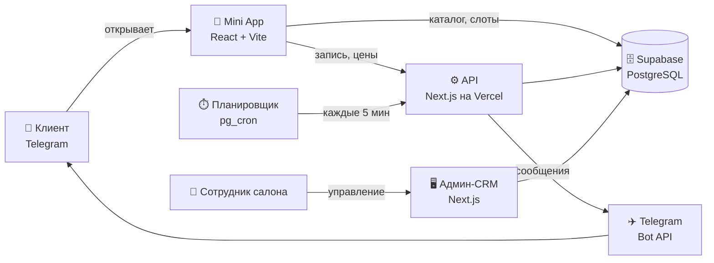

**Принципы архитектуры:**

- **Безопасность платежеспособной логики на сервере.** Цены, скидки и подарки пересчитываются на сервере — клиент не может подделать стоимость.
- **Подлинность пользователя.** Каждый запрос на запись/отзыв проверяется по подписи Telegram (HMAC) — нельзя записаться за другого.
- **Защита от двойной брони.** На уровне базы данных стоит ограничение, не допускающее пересечения записей одного мастера по времени; заказ создаётся атомарно — «всё или ничего».
- **Автоматизация по расписанию.** Напоминания рассылает планировщик в базе данных, без отдельного сервера.

---

## 🛠️ Технологии

| Слой | Технологии |
|------|------------|
| **Клиентское приложение** | Telegram Mini App, React, TypeScript, Vite |
| **Админ-панель** | Next.js (App Router), TypeScript, shadcn/ui, Tailwind CSS |
| **Бэкенд и база** | Supabase (PostgreSQL, RLS, RPC-функции, Storage, pg_cron) |
| **Интеграции** | Telegram Bot API, Google OAuth |
| **Хостинг** | Vercel (CRM и API), Supabase (БД и файлы) |

---

## 🔐 Безопасность и надёжность

- Проверка подписи Telegram `initData` (HMAC-SHA256) на каждом действии.
- Разграничение доступа на уровне строк базы данных (RLS): клиент видит только публичные данные, служебные ключи не покидают сервер.
- Вход в админ-панель через Google с белым списком сотрудников.
- Атомарное создание заказов и защита от пересечения броней средствами СУБД.
- Серверный пересчёт цен и проверка подарков — устойчивость к подмене данных на клиенте.

---

## 📦 Что входит в поставку

- Telegram Mini App для клиентов (исходный код, готовый к деплою).
- Админ-CRM для салона.
- Серверные API-эндпоинты (запись, цены, корзина, отзывы, избранное, отмена, уведомления).
- База данных: схема, бизнес-логика (генерация слотов, рейтинги, акции), демо-данные.
- Настроенные автоматические уведомления.
- Документация по развёртыванию и переменным окружения.

---

## 🚀 Возможности развития

- Онлайн-оплата и предоплата брони.
- Программа лояльности и бонусные баллы.
- Push-рассылки и промо-кампании.
- Перенос записи клиентом (сейчас доступны запись и отмена).
- Мультифилиальность (несколько салонов в одной системе).
- Виджет записи для сайта салона.

---

## 📨 Обсудить проект

Платформу можно внедрить под ваш салон: брендирование, наполнение каталога, настройка мастеров и расписания, запуск под ключ.

**G&D Digital Lab** — мобильные приложения, Telegram Mini Apps и веб-проекты

💬 Написать нам: [@GD_Digital_Lab_bot](https://t.me/GD_Digital_Lab_bot)
🌐 [gddlab.ru](https://gddlab.ru)
📱 Демо платформы: [@beautyapp_salon_bot](https://t.me/beautyapp_salon_bot)

© G&D Digital Lab. Все права защищены.

